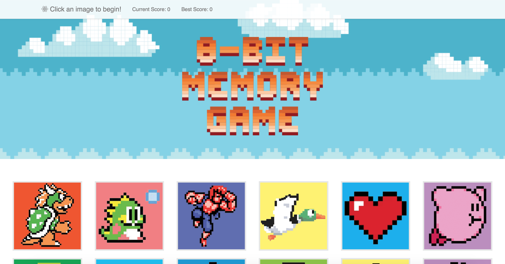
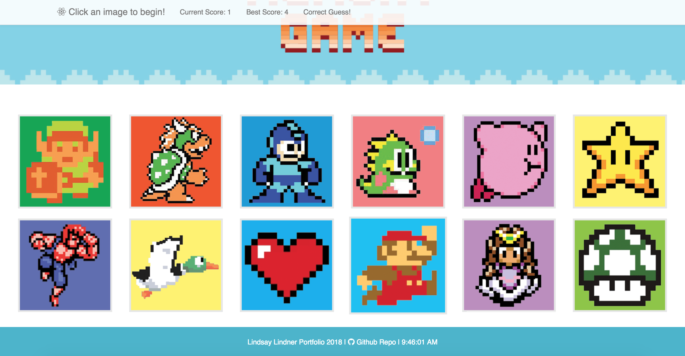

# clicky-game
A React.js memory game that requires you to break up your application's UI into components, manage component state, and respond to user events.

## Apps ##

**React Clicky Game || 8-bit Memory Game**

[Deployed Project](https://lindnerdesign.github.io/clickygame)

## Tools ##

**Technology Used**
* Node
* Javascript
* React
* JSX
